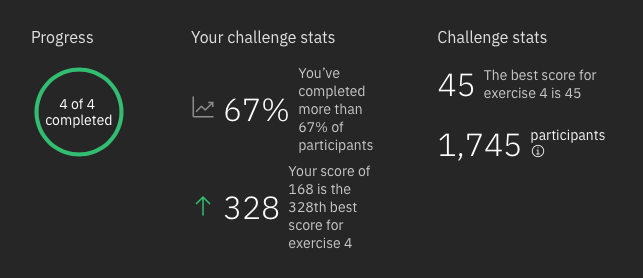

# IBM Quantum Challenge 2020

On April 27, 2020, Jay Gambetta announced [the IBM Quantum Challenge](https://www.ibm.com/blogs/research/2020/04/ibm-quantum-challenge/), which took place between May 4, 2020 and May 8, 2020: To celebrate the fourth anniversary of **IBM Quantum Experience** and its successes over the years, 4 quantum programming exercises have been proposed for enthusiasts.

This repository contains the answers I provided during the event and allowed me to reach the 328th ranking position (1,745 participants entered the challenge, 67% of whom didn't success to terminate it during the allowing time).

Below, as provided by organizers, a brief description of each one of the 4 quantum programming exercises can be found:
* **Exercise 1, basic quantum circuits:** *"This exercise will familiarize you with some basic principles in quantum information science, like understanding what a quantum circuit  is. During this exercise you will learn what a qubit is, how to apply some quantum gates to it, and how to measure its final state. By the end, you will create your own quantum circuits!"* (read Jupyter notebook **1-basic-quantum-circuits.ipynb** to check my solution);
* **Exercise 2, measurement error mitigation:** *"Quantum computers are always subject to noise. To correct for measurement errors, in this level we will introduce the principle behind measurement error mitigation. The goal of this exercise is to create such a calibration matrix that you can then apply to noisy results (provided by us) to infer the noise-free results."* (read Jupyter notebook **2-measurement-error-mitigation.ipynb** to check my solution);
* **Exercise 3, quantum cryptography BB84:** *"This third exercise is about BB84, a cryptography protocol developed in 1984 by one of our most famous IBMers, Charles Bennett, together with his colleague, Gilles Brassard. The goal of this protocol is to create a secret key between two parties, Alice and Bob, that can then be used by both parties to encrypt and decrypt a hidden message, respectively. In this exercise we will guide you through the different steps of the protocol to create a secret key, that can then be used to decrypt a encrypted message."* (read Jupyter notebook **3-quantum-cryptography-BB84.ipynb** to check my solution);
* **Exercise 4, circuit decomposition:** *"The fourth exercise is supposed to puzzle even the quantum experts, so don’t worry if you cannot solve it! If you can, hats off to you! We know that single-qubit rotations and CNOT gates constitute a universal gate set. However, there is no efficient algorithm known so far that gives us a good decomposition. Your task is to find such a decomposition."* (read Jupyter notebook **4-circuit-decomposition.ipynb** to check my solution).

Finally, to conclude, respectively to the requirements, it can be said that the work performed within this challenge has been principally constructed around **Qiskit** (https://qiskit.org), the open-source quantum computing software development framework, mainly supported and developed by IBM, for leveraging today's quantum processors in research, education, and business.

  

